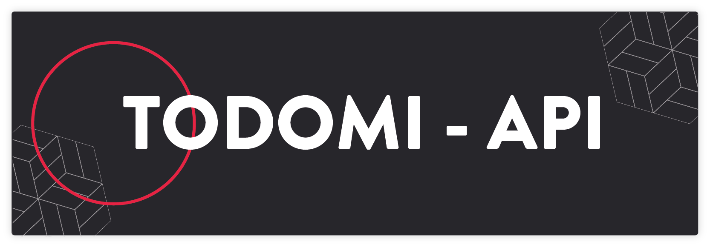
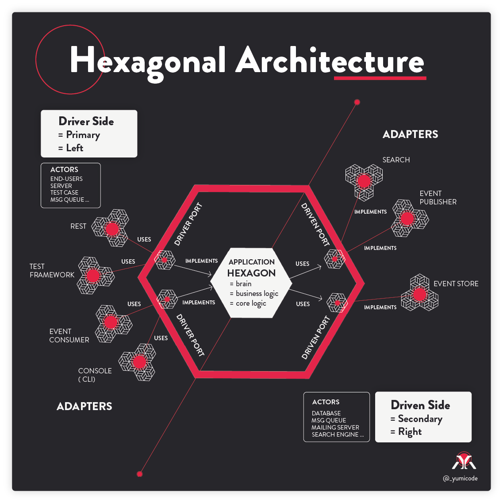

# Todomi API

## Introduction

This API is dedicated to the implementation and exploration of Hexagonal Architecture.

Hexagonal Architecture, also known as "Ports and Adapters" or "Onion Architecture", is a software design pattern that emphasizes the separation of concerns in a system by separating the external interfaces from the internal implementation.

This simple todo list API is made to understand the hexagonal architecture concept with simple features.

This results in a flexible and easily maintainable architecture that can be adapted to changing requirements with minimal impact on the rest of the system.

Hope it can helps :)

## Technologies used

Back-end

- NodeJS
- Express framework
- Typescript
- Jest & Supertest
- Swagger Express UI
- Git versioning

Database

- PostgreSQL
- pgAdmin4 (GUI)
- Sqitch versioning
- MongoDB for testing adapter)

## Hexagonale architecture or Ports and Adapters Architecture (Alistair Cockburn)



## Folder structure

```
├── package-lock.json
├── package.json
├── README.md
├── restClient.http
├── src
|  ├── app
|  |  ├── adapters
|  |  |  ├── primary.driver
|  |  |  |  ├── controllers
|  |  |  |  |  ├── article.ts
|  |  |  |  |  ├── coreController.ts
|  |  |  |  |  └── main.ts
|  |  |  |  └── routes
|  |  |  |     ├── article.ts
|  |  |  |     ├── index.ts
|  |  |  |     └── main.ts
|  |  |  └── secondary.driven
|  |  |     ├── database
|  |  |     |  ├── mongodb.ts
|  |  |     |  └── postgresql.ts
|  |  |     ├── repositories
|  |  |     |  ├── articleRepository.ts
|  |  |     |  ├── data
|  |  |     |  |  └── migration.sql
|  |  |     |  ├── mongo.datamappers
|  |  |     |  |  ├── article.ts
|  |  |     |  |  └── coreDatamapper.ts
|  |  |     |  └── pg.datamappers
|  |  |     |     ├── article.ts
|  |  |     |     └── coreDatamapper.ts
|  |  |     └── swagger
|  |  ├── core
|  |  |  ├── gateways
|  |  |  |  ├── interfaces
|  |  |  |  |  └── articleInterface.ts
|  |  |  |  ├── middlewares
|  |  |  |  ├── schema
|  |  |  |  ├── services
|  |  |  |  |  ├── errorHandler.ts
|  |  |  |  |  └── errorLoggerHandler.ts
|  |  |  |  └── utils
|  |  |  |     └── formattedDate.ts
|  |  |  ├── models
|  |  |  |  ├── articleModel.ts
|  |  |  |  └── coreModel.ts
|  |  |  └── use-cases
|  |  |     └── articleCRUD.ts
|  |  └── Types
|  |     ├── custom.ts
|  |     └── express
|  |        └── index.d.ts
|  ├── index.ts
|  └── __tests__
|     └── article.test.ts
├── tsconfig.json
└── __docs__
   ├── media
   |  └── test.png
   └── test-jest.md
```

## Steps to use this repo

### Get started

You need to install :

- Nodejs
- PostgreSQL

Need to add a .env file and configure with your own environment variable :

```
#MY_PORT=VALUE
PORT=#

#INFO CONNEXION DB FOR PSQL new Client()
PGHOST=#
PGDATABASE=#
PGUSER=#
PGPASSWORD=#
PGPORT=#
```

You'll find all the details in the file [migrations.sql](./src/app/adapters/secondary.driven/repositories/data/migration.sql) for deploy a basic database and some datas :

```sql
--====================================
-- Create DB and table
--====================================

DROP DATABASE taskedo;

CREATE DATABASE taskedo;

CREATE TABLE article (
    "id" INT GENERATED ALWAYS AS IDENTITY PRIMARY KEY,
    "content" TEXT NOT NULL,
    "created_at" TIMESTAMPTZ DEFAULT now(),
    "is_done" BOOLEAN DEFAULT false
);

--====================================
-- Insert some values
--====================================

INSERT INTO article ("content", "created_at")
(
	SELECT
		('task' || ' ' || serie_nb),
		(now() + interval '23 hours')
	FROM generate_series( 1, 9) as serie_nb
);


--========================================
-- Create 2 functions create and update
--========================================

CREATE OR REPLACE FUNCTION create_article(JSON)
RETURNS TEXT AS $$

    INSERT INTO "article"("content")
    VALUES ($1 ->> 'content')::TEXT
    RETURNING "content";

$$ LANGUAGE SQL;

CREATE OR REPLACE FUNCTION update_article(JSON)
RETURNS TEXT AS $$

    UPDATE "article"
    SET
        "content" = COALESCE(($1 ->> 'content')::TEXT,"content"),
        "is_done" = COALESCE(($1 ->> 'is_done')::BOOLEAN,"is_done"),
    WHERE "id" = articleId::INT
    RETURNING "content";

$$ LANGUAGE SQL;
```

- You'll find a file named `restClient.http` for testing your routes. To use it, you'll need to add REST Client VS Code extension (or you can use Insomnia, Postman etc...)

- The format for JSON to create or update a task is the following:

```json
// to add a task
{
  "content": "task added !",
}


// for update a task, is_done is not required
{
  "content": "task updateeeeeed !",
  "is_done": true
}
```

## Launch the app

Initialize :

```sh
npm init
```

Install all the dependencies :

```sh
npm i
#or
npm install
```

Launch the server in development environment :

```sh
npm run dev
```

## Todolist

- Create a user and add connexion

---

### Sources

- Training [Wealcome](https://wealcomecompany.com/) with [Michaël Azerhad](https://www.linkedin.com/in/%E2%9A%A1%EF%B8%8Fmicha%C3%ABl-azerhad-9058a044/)
- Thanks to [Alistair Cockburn](https://github.com/totheralistair/SmallerWebHexagon) for taking time to help me and let me redraw the diagram :)
- [Original article of hexagonal architecture](https://alistair.cockburn.us/hexagonal-architecture/)
