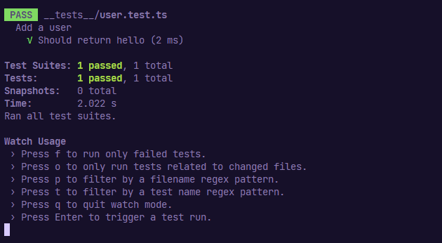

# Test with Jest

## Packages

```sh
npm i -D jest ts-jest @types/jest supertest @types/supertest
```

- jest for testing
- ts-jest for transforming test files in Typescript into Javascript before running test
- @types contains types definitions for each specific package

If you have an error like :

```sh
    import User from '../app/hexagon/use-cases/user/addUser';
    ^^^^^^

    SyntaxError: Cannot use import statement outside a module
```

You need to configure a jest.

Create in your root project a _jest.config.js_ file and add :

```js
export default {
  preset: 'ts-jest',
  testEnvironment: 'node',
  transform: {
    '^.+\\.ts?$': 'ts-jest',
  },
  transformIgnorePatterns: ['<rootDir>/node_modules/'],
};
```

## Write the test

In test file :

```js
//~ Import modules
import User from '../src/app/hexagon/use-cases/user/addUser';

//& Add a user
describe('Add a user', () => {
  it('Should return hello', () => {
    expect(User.getHello()).toBe('Hello');
  });
});
```

In app file :

```js
export default class User { 
    static getHello = () => {
        return "Hello";
    }
};
```


And then the test pass :


